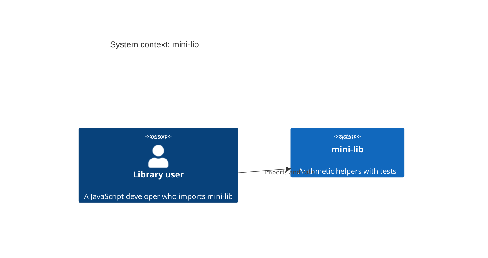

# C4 level 1: system context

mini-lib is a small arithmetic library used by JavaScript developers.

```mermaid
C4Context
  title System context: mini-lib
  Person(dev, "Library user", "A JavaScript developer who imports mini-lib")
  System(lib, "mini-lib", "Arithmetic helpers with tests")
  Rel(dev, lib, "Imports and calls")
```
