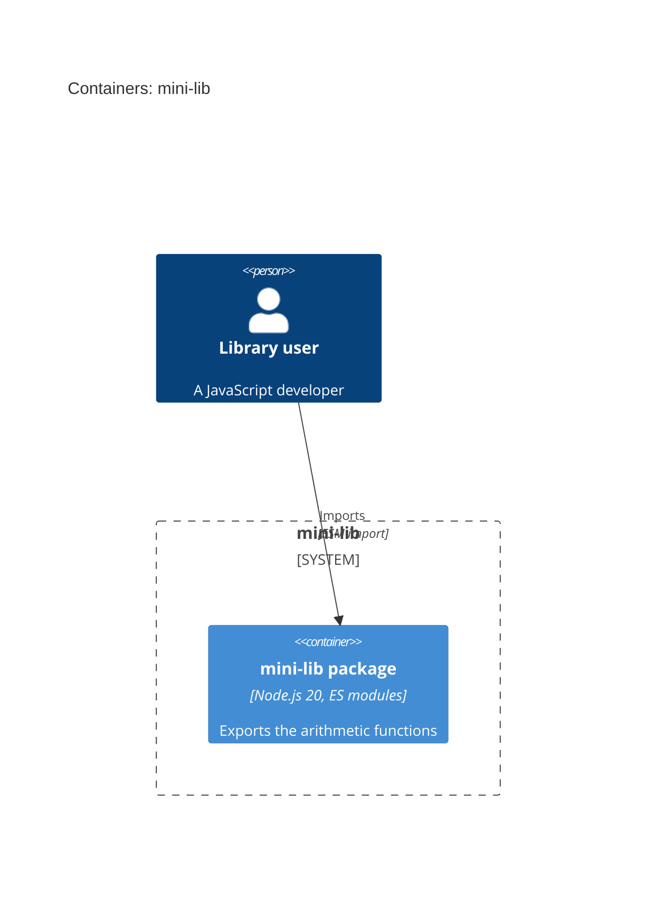

# C4 level 2: containers

mini-lib is a single ES module package. It has no server and no datastore.

```mermaid
C4Container
  title Containers: mini-lib
  Person(dev, "Library user", "A JavaScript developer")
  System_Boundary(sys, "mini-lib") {
    Container(pkg, "mini-lib package", "Node.js 20, ES modules", "Exports the arithmetic functions")
  }
  Rel(dev, pkg, "Imports", "ESM import")
```
